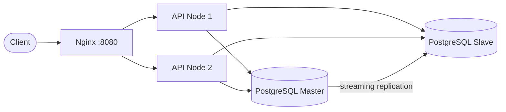

# Design: repository layout

This document maps the **folder and file hierarchy** to **purpose** in the system: load-balanced API, replicated PostgreSQL, and the .NET service layout.

---

## High-level architecture



- **Single entry:** `infra/nginx` → two API containers (`docker-compose.yml`).
- **Write path:** API → master DB.
- **Read path:** API → slave DB.
- **`processed_by`:** identifies which API instance answered (proves load balancing).

---

## Repository file tree

Omitted: build outputs (`**/bin/`, `**/obj/`), local `.env`, IDE caches, and other generated artifacts.

```
Scalable-System-Design-Implementation/
├── .env.example                    # Template for DB passwords; copy to `.env` (gitignored)
├── .gitignore                      # Excludes secrets, build artifacts
├── docker-compose.yml              # Full stack: Postgres master/slave, 2× API, Nginx
├── Scalable-System-Design-Implementation.sln
├── README.md                       # Quick start and API overview
├── requirements.md                 # Assignment / rubric source (external spec)
├── package.json                    # Optional Node tooling; not required for .NET API
├── package-lock.json
│
├── docs/
│   ├── setup.md                    # End-to-end runbook (Docker, replication checks, pgAdmin)
│   └── design.md                   # This document — layout and rationale
│
├── infra/
│   └── nginx/
│       └── default.conf            # Upstream pool: api-node-1, api-node-2 (load balancing)
│
└── src/
    └── ProductApi/                 # ASP.NET Core minimal API (.NET 10)
        ├── Program.cs              # Host bootstrap: DI, DB init, endpoint mapping
        ├── ProductApi.csproj
        ├── Dockerfile              # Multi-stage build → runtime image on port 8080
        ├── ProductApi.http         # IDE-friendly HTTP samples (health, products)
        ├── appsettings.json        # Default connection strings for local `dotnet run`
        ├── appsettings.Development.json
        │
        ├── Properties/
        │   └── launchSettings.json # Local URL (5080), env profile for development
        │
        ├── Domain/
        │   └── Entities/
        │       └── Product.cs      # Domain entity (no HTTP / persistence wiring)
        │
        ├── Features/               # Vertical slices — one folder per feature area
        │   ├── Health/
        │   │   └── HealthEndpoints.cs    # GET /health
        │   └── Products/
        │       ├── ProductEndpoints.cs    # POST/GET /products, processed_by metadata
        │       └── CreateProductRequest.cs
        │
        └── Infrastructure/
            ├── ServiceCollectionExtensions.cs   # AddPersistence — EF Core + Npgsql registration
            ├── WebApplicationExtensions.cs       # EnsureCreated on write/read contexts at startup
            └── Persistence/
                └── ProductDbContext.cs          # Write/read DbContexts, EF mapping to `products`
```

---

## Purpose by area

| Location | Role |
|----------|------|
| **Root `docker-compose.yml`** | Defines services, networks, volumes; wires env vars and connection strings to the API. |
| **`.env.example` / `.env`** | Keeps database passwords out of committed compose defaults when you override them locally. |
| **`infra/nginx/default.conf`** | Single HTTP entry; proxies to both API replicas for round-robin–style distribution. |
| **`src/ProductApi/Program.cs`** | Composition root: register persistence, apply startup DB creation, map routes. |
| **`Domain/Entities`** | Core model only; stays independent of EF and HTTP contracts. |
| **`Features/*`** | Minimal API route groups and request types; easy to extend with new slices. |
| **`Infrastructure/*`** | Cross-cutting technical concerns: DbContext, DI extensions, startup DB initialization. |
| **`appsettings*.json`** | Configuration for non-container runs; Docker overrides via environment variables. |
| **`ProductApi.http`** | Repeatable manual tests without extra tools. |
| **`docs/setup.md`** | Operational guide (ports, replication verification, pgAdmin). |
| **`requirements.md`** | External assignment text; not executed by the app. |

---

## Docker Compose services (logical view)

| Compose service | Maps to tree / runtime |
|-----------------|-------------------------|
| `postgres-master` | Bitnami Postgres primary; data volume `postgres_master_data`. |
| `postgres-slave` | Bitnami replica; host port **5433** → container **5432**. |
| `api-node-1`, `api-node-2` | Built from `src/ProductApi/Dockerfile`; `ServerId` distinguishes nodes. |
| `nginx` | Uses `infra/nginx/default.conf`; publishes **8080** → **80**. |

---

## Data flow (files involved)

1. **HTTP** hits **Nginx** (`infra/nginx/default.conf`).
2. Request goes to **one** of the API containers (`Features/Products/ProductEndpoints.cs`).
3. **POST** uses **`WriteProductDbContext`** → **master** (`Infrastructure/Persistence/ProductDbContext.cs`, compose `ConnectionStrings__WriteDb`).
4. **GET** uses **`ReadProductDbContext`** → **slave** (`ConnectionStrings__ReadDb`).
5. **`processed_by`** comes from config/env (`ServerId` / `SERVER_ID`) in the same endpoint file.

This layout keeps **infrastructure concerns** (compose, nginx, replication) at the repo edge and **application concerns** (features, domain, persistence wiring) under `src/ProductApi/`.
